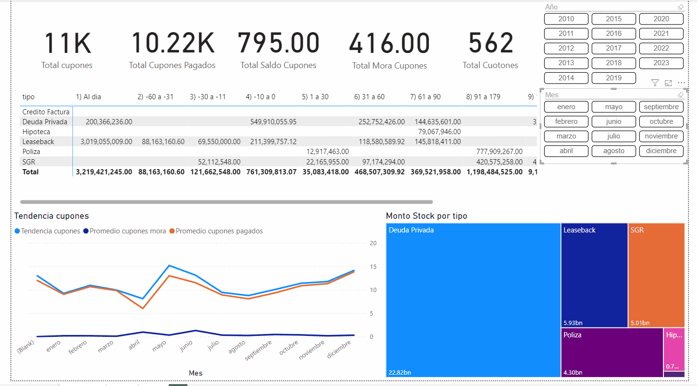

[link a dashboard](https://app.powerbi.com/view?r=eyJrIjoiMjcxZDZjYTItYmM1NC00NjM5LTg1NmItN2QwZTNiM2Y1MTJmIiwidCI6ImZlNTVmYTkxLTI3NDQtNGRjMi04YWViLTNlODA3ZmY1ZjEwNiIsImMiOjR9&pageName=ReportSection90c20cfa0567b48ea749)

The dashboard consists of two main pages: "Dashboard" and "Payment." Each page offers specific functionalities for analyzing and managing delinquencies and payment calculations.

Page 1: Dashboard
General Overview:
The "Dashboard" page provides a detailed summary of delinquencies according to the specific month or year closure, based on the applied filters.

Key Elements:

Customizable Filters:
Allow the selection of a specific month or year to view delinquency information.

Coupon Trend Chart:
Displays the trend of coupons by month in general, helping to identify patterns and trends over time.

Treemap Chart:
Shows the size of the debt visually, enabling easy comparison of debt amounts.

Key Performance Indicators (KPIs):
Includes important metrics related to interest and other relevant data points.

Page 2: Payment
Payment Calculator:
The "Payment" page features a calculator that determines the payment amount for an installment based on the day and type of currency. It applies the compound interest formula to provide accurate payment calculations.

Key Elements:

Date and Currency Type Input:
Users can input the specific date and select the type of currency.

Compound Interest Formula Application:
The calculator applies the compound interest formula to compute the payment amount accurately.

Technologies Used:
This dashboard was created using Python, SQL, and Power BI.
